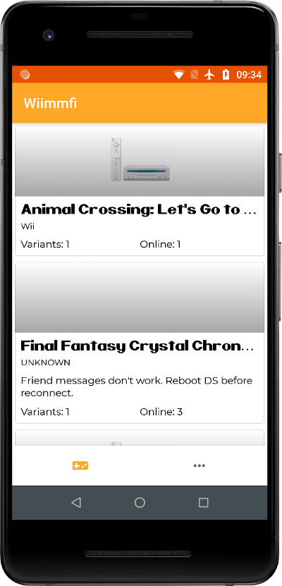
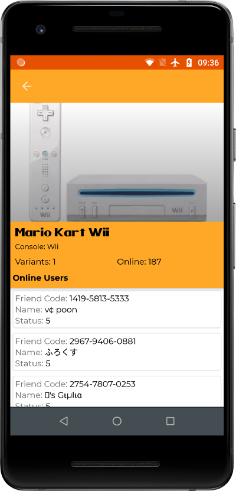
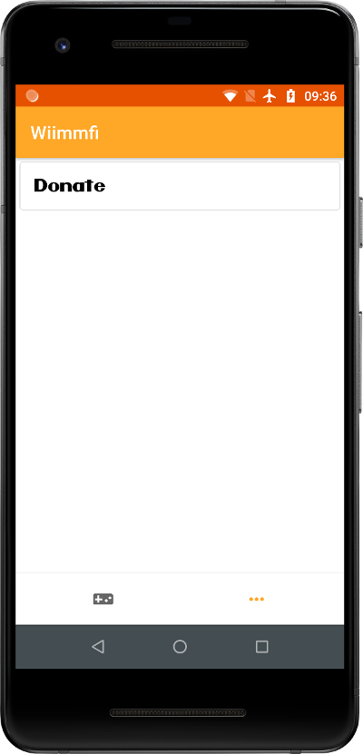

# Wiimmfi App

An app that use the Wiimmfi-Project info. This project is not maintained by Wiimmfi-Project staff.

### What is Wiimmfi-Project

According to information available on Wiimmfi:

> The Nintendo Wi-Fi Connection (WFC) service was an online gaming service that provided free online play in various Nintendo DS and Wii games. Nintendo discontinued the service on May 20th, 2014, primarily because the host of the service, GameSpy, was shutting down its servers. Nintendo WFC was required for online play, but the Wiimmfi Project has replicated much of its functionality and allows for continued online play in Mario Kart Wii and other games.

> Wiimmfi is available for the public since May 10th, 2014 (10 days before WFC shutdown). It started with Mario Kart Wii and supports now more than 100 games. Read »Development of Wiimmfi« for details.

> To use Wiimmfi, the games must be patched to use the new domains and also to change some other settings. See »Wiimmfi Patcher« for more details.

More info:

[Site](https://wiimmfi.de/)

[Wiki](http://wiiki.wii-homebrew.com/Wiimmfi_%28en%29)

Screenshots
-----------

See stats of all games available.

See online users.

And other information about Wiimmfi Project.

Version
--------
This project started as a android app. It's code is on the `android` branch.

License
--------

    Copyright 2023 Vilmar Bispo Filho

    Licensed under the Apache License, Version 2.0 (the "License");
    you may not use this file except in compliance with the License.
    You may obtain a copy of the License at

       http://www.apache.org/licenses/LICENSE-2.0

    Unless required by applicable law or agreed to in writing, software
    distributed under the License is distributed on an "AS IS" BASIS,
    WITHOUT WARRANTIES OR CONDITIONS OF ANY KIND, either express or implied.
    See the License for the specific language governing permissions and
    limitations under the License.